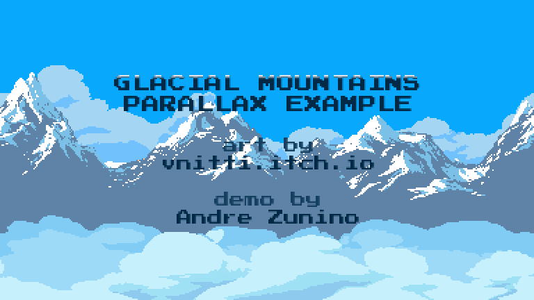

# Glacial Mountains



This is a simple example demonstrating the use of [parallax scrolling](https://en.wikipedia.org/wiki/Parallax_scrolling).

## Dependencies

* [SDL2](https://www.libsdl.org/) and [SDL2_image](https://www.libsdl.org/projects/SDL_image/)
```sh
sudo apt install libsdl2-dev libsdl2-image-dev
```

## Building

```sh
make
```
Note: The included *Makefile* uses g++, but you should be able to build with any compiler supporting C++17.

## Artwork

The actual [Glacial Mountains artwork](https://vnitti.itch.io/glacial-mountains-parallax-background) was created by [vnitti](https://vnitti.itch.io/).

